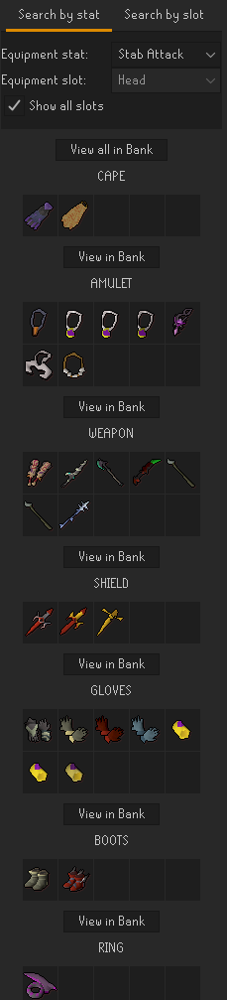
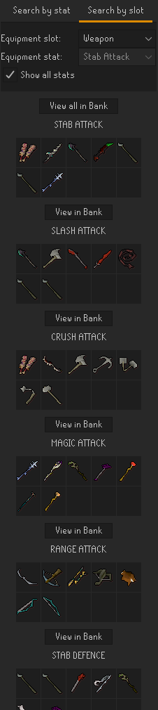
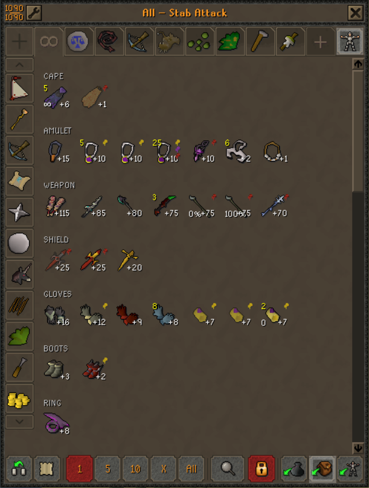
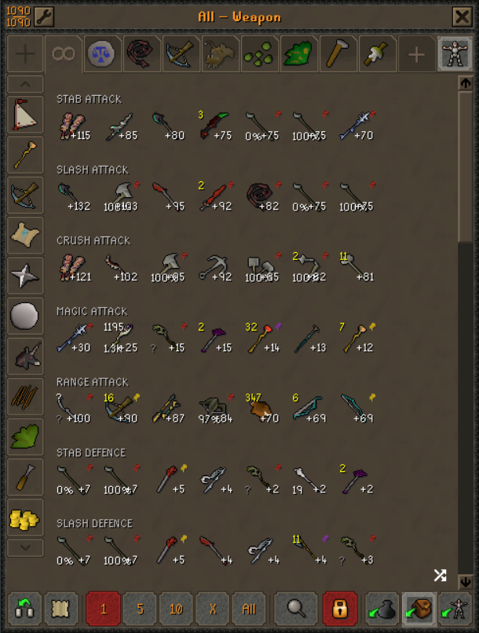
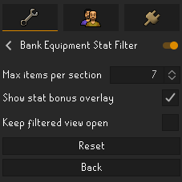

# Bank Equipment Stat Filter

Adds a RuneLite side panel that searches your bank for equipment and sorts it from highest to lowest by combat stat.

Forget what your best magic attack bonus helmet is? This plugin shows you the relevant items in your bank, ordered by their bonus, so you can quickly tell which one you want to use. You can search in either direction: choose a stat to compare every equipment slot, or choose a slot to compare every stat.

## Features

- Search by stat to find your best banked items for each equipment slot.
- Search by equipment slot to compare its best items across every supported stat.
- Show every slot or stat at once, or narrow the results with the dropdown menus.
- Automatically refresh results when you change search modes or selections.
- Hover over an item in the side panel to see its name and selected stat bonus.
- Open an individual result section or all visible sections as an ordered temporary Bank Tags view.
- Display section labels and stat bonuses directly in temporary bank views.
- Optionally restore a temporary filtered view after closing and reopening the bank.

## Usage

Open the plugin panel using this icon:

You must open your bank once so the plugin can read its contents. After the bank has been opened, the side-panel searches remain available while RuneLite stays open, even when the bank itself is closed.

Results include only equipment with a positive value for the selected stat and are sorted from highest to lowest. There is no search button: changing a tab, dropdown, or checkbox updates the results automatically.

### Search by stat

Use **Search by stat** to select a combat stat and see the best items for each equipment slot. Keep **Show all slots** enabled to display every applicable slot, or disable it to select one slot from the equipment-slot dropdown.

### Search by slot

Use **Search by slot** to select an equipment slot and see its best items for each supported stat. Keep **Show all stats** enabled to display every applicable stat, or disable it to select one stat from the equipment-stat dropdown.

An item can appear in multiple sections when it is one of the best choices for more than one stat.

## View in Bank

The **View in Bank** buttons require both your bank and RuneLite's **Bank Tags** plugin to be open and active. When either requirement is unavailable, the buttons are disabled and their hover text explains what is needed.

- **View in Bank** opens the items from one result section.
- **View all in Bank** opens every currently displayed section in the same order shown in the side panel.

These views use a temporary tag and ordered layout; they do not create or modify permanent Bank Tags tabs. Combined views separate the sections into labeled rows, while small labels on the items show their bonus for that section. Charged, ornamented, and other canonical item variants are matched where supported by RuneLite.

### Viewing all slots for a stat

The friendly bank title identifies the selected stat, and each row is labeled with its equipment slot.

### Viewing all stats for a slot

The friendly bank title identifies the selected slot, and each row is labeled with its stat. The same item may appear in more than one row with the appropriate bonus for each stat.

## Configuration

- **Max items per section** controls how many items appear in each section when **Show all slots** or **Show all stats** is enabled. A single selected section is not limited.
- **Show stat bonus overlay** controls the small bonus labels drawn on items in temporary filtered bank views. It is enabled by default.
- **Keep filtered view open** restores the active temporary equipment view when the bank is closed and reopened during the same login session. It is disabled by default.

## Things to Note

This plugin does **not** necessarily tell you the best item to use; it simply sorts items by one stat. It does not account for effects such as set bonuses or weapon attack speed.

If you log into a different OSRS account, the plugin may continue showing items from the previous account's bank until you open the bank on the new account.

Placeholders in your bank are included in the results.
